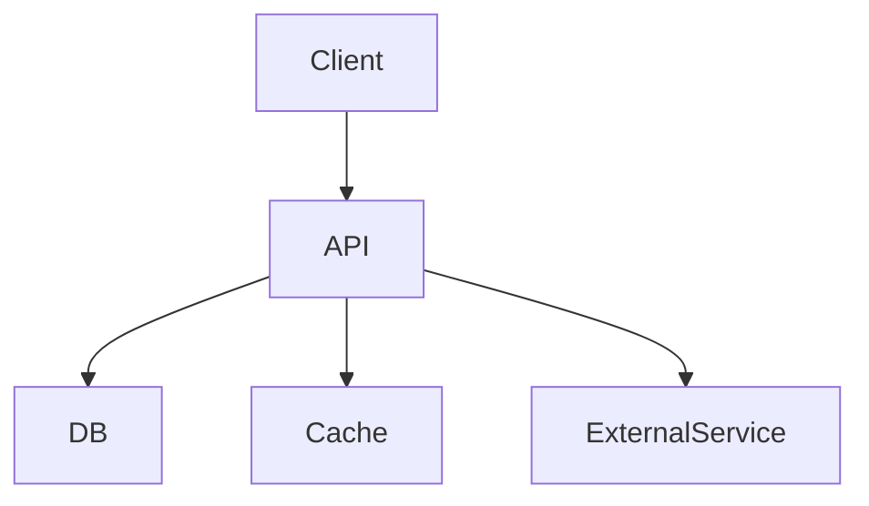

# Архитектура — High Level

> Крупные блоки системы и как они общаются. Без деталей реализации.
> Цель: любой человек должен понять общую картину за 5 минут.

---

## Тип архитектуры

- [ ] Монолит
- [ ] Монолит с модулями (modular monolith)
- [ ] Микросервисы
- [ ] Десктопное приложение
- [ ] CLI инструмент
- [ ] Библиотека

Почему именно так (не другое):
```
[Обоснование]
```

---

## Компоненты системы

Перечисли все крупные блоки. Для каждого — одно предложение что он делает.

| Компонент | Что делает | Технология |
|-----------|-----------|------------|
| Frontend | Интерфейс пользователя | React / Qt / ... |
| Backend API | Бизнес-логика, обработка запросов | FastAPI / Express / ... |
| База данных | Хранение данных | PostgreSQL / SQLite / ... |
| Кэш | Быстрый доступ к частым данным | Redis / in-memory / ... |
| ... | ... | ... |

---

## Схема взаимодействия

Нарисуй стрелками кто с кем общается и по какому протоколу.

```
[Клиент]
    |
    | HTTP/REST
    v
[Backend API]  <-->  [База данных]
    |
    | TCP
    v
[Внешний сервис / очередь / ...]
```

<!-- Можно использовать Mermaid если хочешь рендер в GitHub:


-->

---

## Поток данных

Опиши основной сценарий от действия пользователя до ответа системы.

```
1. Пользователь нажимает [действие]
2. Клиент отправляет [запрос] на [endpoint]
3. API проверяет [авторизацию / данные]
4. API обращается к [БД / кэшу / сервису]
5. Возвращает [ответ]
6. Клиент отображает [результат]
```

---

## Внешние зависимости

Что система использует снаружи (сторонние API, сервисы, библиотеки уровня архитектуры)?

| Зависимость | Зачем | Fallback если недоступна |
|-------------|-------|--------------------------|
| ... | ... | ... |

---

## Что намеренно упрощено в v1

Что ты сознательно не делаешь сейчас, но архитектура должна это учитывать?

```
[Например: нет кэширования, нет CDN, нет очередей — всё синхронно]
```
